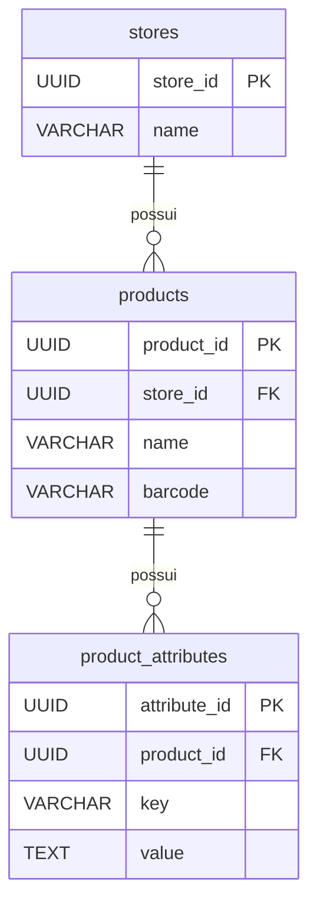

# Sessão 2 — Chaves & Fundamentos de Modelagem de Dados

**Tópicos:** Chaves de partição, propriedades de itens & DynamoDB JSON, ordenamento, convenções de chaveamento e hierarquia, paginação

&nbsp;

---

&nbsp;

## Passo 0 — Configurando as Credenciais AWS

Antes de rodar qualquer comando do CLI, é necessário exportar as credenciais para que o AWS CLI e o SDK as encontrem automaticamente via variáveis de ambiente:

```bash
export AWS_ACCESS_KEY_ID=your_access_key_id
export AWS_SECRET_ACCESS_KEY=your_secret_access_key
export AWS_REGION=us-east-1
```

Todos os comandos `aws dynamodb` das seções seguintes inferem as credenciais automaticamente a partir dessas variáveis.

&nbsp;

---

&nbsp;

## Passo 1 — O Ponto de Partida Relacional

Antes de tocar no DynamoDB, vamos nos ancorar em um modelo familiar. Imagine uma plataforma de e-commerce multi-tenant com três entidades:

```sql
-- Lojas
CREATE TABLE stores (
  store_id   UUID PRIMARY KEY,
  name       VARCHAR(255) NOT NULL
);

-- Produtos
CREATE TABLE products (
  product_id UUID PRIMARY KEY,
  store_id   UUID NOT NULL REFERENCES stores(store_id),
  name       VARCHAR(255) NOT NULL
  barcode    VARCHAR(255) NOT NULL
);

-- Atributos de Produto (pares chave-valor, ex: cor, tamanho, peso…)
CREATE TABLE product_attributes (
  attribute_id UUID PRIMARY KEY,
  product_id   UUID NOT NULL REFERENCES products(product_id),
  key          VARCHAR(100) NOT NULL,
  value        TEXT NOT NULL
);
```

**Relacionamentos em resumo:**



- Uma **loja** possui muitos **produtos**
- Um **produto** possui muitos **atributos** (pares chave-valor flexíveis, sem schema fixo)

No SQL isso é direto ao ponto: JOIN por chaves estrangeiras, filtro em qualquer coluna, índices conforme necessário. Vamos usar isso como base para explorar as restrições do DynamoDB.

&nbsp;

---

&nbsp;

## Passo 2 — Primeira Tentativa no DynamoDB: Três Tabelas, Só PK

A migração ingênua: uma tabela por entidade, usando os mesmos UUIDs como chaves de partição.

```
Tabela: stores          PK: store_id (UUID)
Tabela: products        PK: product_id (UUID)
Tabela: product_attrs   PK: attribute_id (UUID)
```

&nbsp;

### Criando as tabelas com o AWS CLI

```bash
# Tabela: stores
aws dynamodb create-table \
  --table-name stores \
  --attribute-definitions AttributeName=store_id,AttributeType=S \
  --key-schema AttributeName=store_id,KeyType=HASH \
  --billing-mode PAY_PER_REQUEST

# Tabela: products
aws dynamodb create-table \
  --table-name products \
  --attribute-definitions AttributeName=product_id,AttributeType=S \
  --key-schema AttributeName=product_id,KeyType=HASH \
  --billing-mode PAY_PER_REQUEST

# Tabela: product_attrs
aws dynamodb create-table \
  --table-name product_attrs \
  --attribute-definitions AttributeName=attribute_id,AttributeType=S \
  --key-schema AttributeName=attribute_id,KeyType=HASH \
  --billing-mode PAY_PER_REQUEST
```

&nbsp;

### DynamoDB JSON vs. JSON comum

O DynamoDB armazena itens em um formato JSON tipado. Cada valor é envolvido por um descritor de tipo:

| Tipo SQL   | DynamoDB JSON        | AWS SDK v3 (marshalled) |
|------------|----------------------|-------------------------|
| VARCHAR    | `{"S": "hello"}`     | `"hello"`               |
| NUMBER     | `{"N": "42"}`        | `42`                    |
| BOOLEAN    | `{"BOOL": true}`     | `true`                  |
| NULL       | `{"NULL": true}`     | `null`                  |
| List       | `{"L": [...]}`       | `[...]`                 |
| Map        | `{"M": {...}}`       | `{...}`                 |

O `@aws-sdk/lib-dynamodb` (DocumentClient) **faz o marshal automaticamente** de objetos JS comuns — raramente você verá os wrappers de tipo no código da aplicação.

&nbsp;

### O que conseguimos ✅ e o que não conseguimos ❌

✅ `GetItem` por UUID exato — O(1), muito rápido  
❌ "Me dê todos os produtos da loja X" — **sem conceito de chave estrangeira**, não há como consultar por `store_id` sem um `Scan`

> **`Scan`** lê todos os itens da tabela e filtra no lado do cliente — funciona, mas é caro e lento em escala. Vamos falar sobre o porquê (e quando é aceitável) em detalhes.

&nbsp;

---

&nbsp;

## Passo 3 — Migrando para GTIN e o Problema de Colisão

O time de produto quer usar o **GTIN** (código de barras) como identificador do produto em vez de UUIDs internos. Faz sentido — é universal, legível por humanos e já vem impresso nas embalagens.

**O problema:** duas lojas diferentes podem vender o mesmo produto (mesmo GTIN). Se `product_id = GTIN`, a chave colide e os itens se sobrescrevem.

&nbsp;

### Chave string composta: `"{storeId}#{productId}"`

O idioma do DynamoDB é **embutir hierarquia na string da chave** usando um delimitador:

```
PK = "store_ABC#8410000012" 
```

Convenções de nomeação de chaves:
- Use `#` como separador de hierarquia (convenção comum)
- Ordene do **mais geral → mais específico** (loja → produto)
- Mantenha os prefixos curtos mas significativos (`STORE#`, `PROD#`, `ATTR#`)

Isso resolve a unicidade: o mesmo GTIN em duas lojas diferentes vira duas chaves de partição distintas.

&nbsp;

### O que ainda não conseguimos ❌

"Listar todos os produtos da loja ABC" → o `GetItem` precisa da **chave completa**, então wildcards como `store_ABC#*` não funcionam. O DynamoDB não tem `LIKE` nem range com prefixo em uma única chave de partição.  
Uma opção é o `Scan` — mas vamos falar sobre por que isso é o último recurso.

&nbsp;

---

&nbsp;

## Passo 4 — Tabela com Chave Composta: PK (storeId) + SK (productId)

A solução: separar `storeId` e `productId` na **chave de partição (PK)** e na **chave de ordenação (SK)** respectivamente.

```
Tabela: products_v2

PK (HASH)  = store_id       → "store_ABC"
SK (RANGE) = product_id     → "prod#8410000012"
```

Isso nos dá:
- **GetItem** de um produto específico → `PK=store_ABC, SK=prod#8410000012`
- **Query** de todos os produtos de uma loja → `PK=store_ABC` (retorna todos os itens da partição, ordenados por SK)
- **Query com prefixo** → `PK=store_ABC, SK begins_with "prod#"`
- **Paginação** → Query retorna até 1 MB; use `LastEvaluatedKey` para continuar

&nbsp;

### Criando a tabela melhorada

```bash
aws dynamodb create-table \
  --table-name products_v2 \
  --attribute-definitions \
    AttributeName=store_id,AttributeType=S \
    AttributeName=product_id,AttributeType=S \
  --key-schema \
    AttributeName=store_id,KeyType=HASH \
    AttributeName=product_id,KeyType=RANGE \
  --billing-mode PAY_PER_REQUEST
```

&nbsp;

### Consultando produtos de uma loja (com paginação)

&nbsp;

### Ordenamento & design da SK

Os itens dentro de uma partição são **sempre ordenados lexicograficamente pela SK** (ascendente por padrão). Isso significa:
- `"prod#0001"` vem antes de `"prod#0002"` ✅
- `"prod#10"` vem antes de `"prod#9"` ❌ (lexicográfico, não numérico!)
- Use zero-padding em sufixos numéricos se a ordem importa: `"prod#0010"`

&nbsp;

### Resumo dos conceitos abordados

| Conceito | Conclusão |
|---|---|
| Somente PK | `GetItem` rápido, sem range queries |
| Chave string composta `A#B` | Resolve unicidade em ambientes multi-tenant |
| PK + SK | Habilita `Query` — a operação principal do DynamoDB |
| Design da SK | Codifica hierarquia e ordem de classificação |
| Paginação | Padrão com `LastEvaluatedKey` / `ExclusiveStartKey` |
| DynamoDB JSON | Wrapper tipado; `lib-dynamodb` faz o marshal de forma transparente |

&nbsp;

---

&nbsp;

> **Próximo passo:** executar queries ao vivo em [`index.ts`](./index.ts) contra uma instância local do DynamoDB (DynamoDB Local ou LocalStack).
